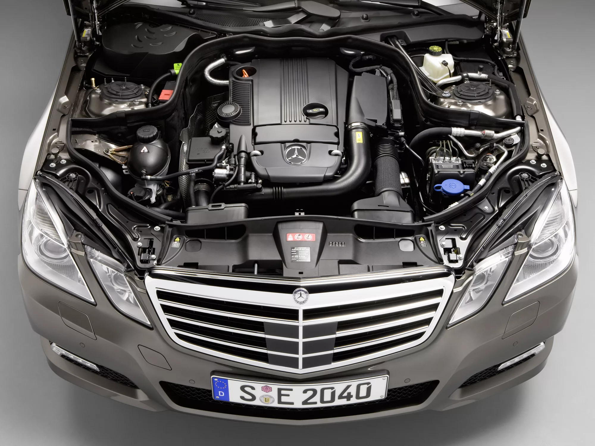
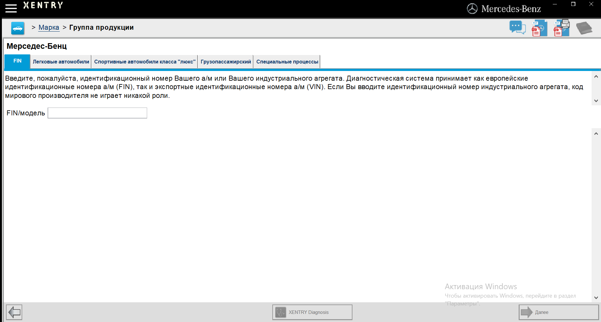
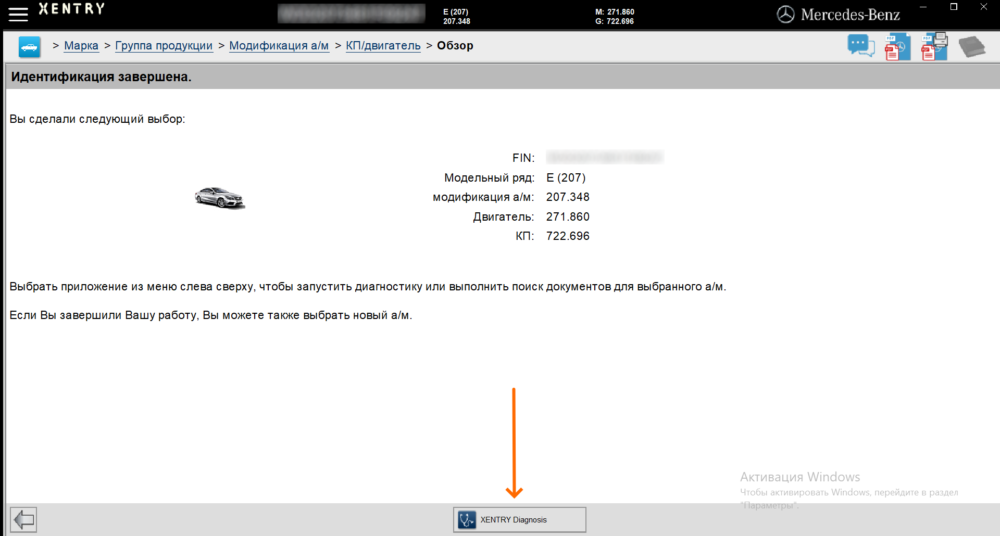
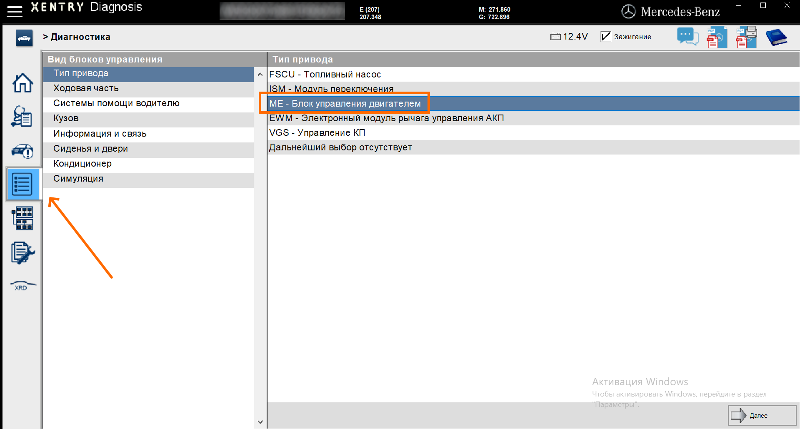
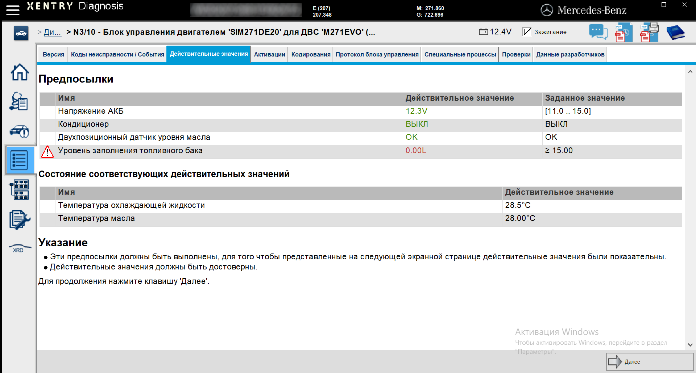
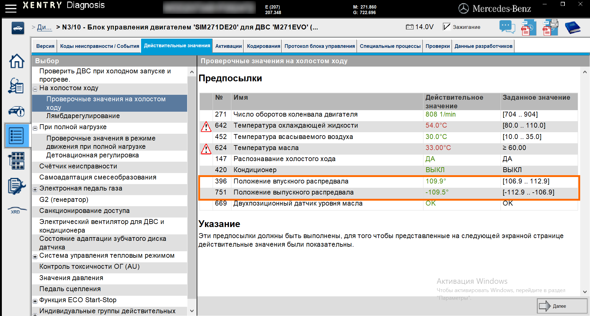
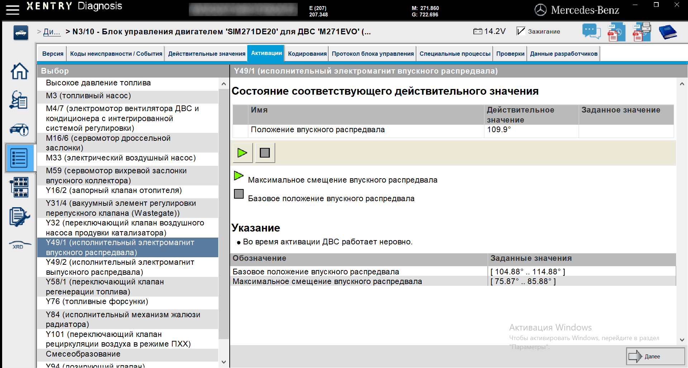

> В статье описывается метод самостоятельной диагностики состояния цепи ГРМ и звезд фазовращателей с помощью OpenPort и Xentry.

## Интро
Двигатель M271 — распространенный мотор на автомобилях Mercedes на российском рынке. Разработанный в 2002 году как компрессорный мотор и впоследствии переделанный под турбину, этот двигатель встречается на автомобилях вплоть до 2015 года выпуска.

Одной из основных проблем двигателя M271 является износ цепи ГРМ и звезд фазовращателей. Со временем цепь ГРМ растягивается, что приводит к смещению фаз газораспределения. Данная неисправность может вызвать снижение мощности двигателя, неустойчивую работу на холостом ходу и даже повреждение внутренних компонентов мотора.

Проблемы с муфтами фазовращателей могут проявляться в виде шума при запуске двигателя и ухудшении динамики автомобиля. В случае серьезной неисправности загорается "чек", и автомобиль перестает заводиться.

Своевременная диагностика двигателя поможет выявить проблему на ранней стадии, что позволит избежать множества связанных неприятностей. Владелец автомобиля сможет своевременно спланировать ремонт и сэкономить деньги.

Ниже опишу метод диагностики состояния цепи и звезд без разборки двигателя с помощью модуля OpenPort и Xentry Diagnosis.

## Вводные данные
Диагностику буду показывать на примере автомобиля Mercedes-Benz E-Class купе в кузове C207. Автомобиль 2010 года, дорест, двигатель M271 EVO, КПП 5G-Tronic.

Для диагностики понадобится:
- Адаптер OpenPort. Я пользуюсь китайской версией с али. Купить можно [тут](https://aliexpress.ru/item/32809926925.html).
- Ноутбук с установленным Xentry Diagnosis.

## Диагностика

1. Подключаем OpenPort к автомобилю и поворачиваем ключ в первое положение.

2. Подключаем OpenPort к ноутбуку через usb провод.

3. Включаем ноутбук и запускаем Xentry.

4. Вводим VIN нашего автомобиля и нажимаем "Далее".

5. После идентификации автомобиля, Xentry отобразит краткую информацию о модели, двигателе и коробке.

Дальнейшие проверки будут касаться работы прогретого двигателя на холостом ходу. Заводим автомобиль и, для удобства, открываем капот, чтобы в дальнейшем было легче обнаружить посторонние шумы.

Запускам Xentry Diagnosis:

После запуска автомобиля, Xentry проведет входной тест автомобиля и выведет информацию о накопленных ошибках. Заходим в раздел "Диагностика" - "Тип привода" - "ME - Блок управления двигателем":

Откроется окно с информацией о блоке управления двигателем и необходимыми требованиями (предпосылками) для запуска проверки. Если все в норме, нажимаем "Далее":

В боковом меню выбираем "На холостом ходу" - "Проверочные значения на холостом ходу":

В данном разделе можно посмотреть информацию о состоянии цепи ГРМ. Действительные значения можно посмотреть только на заведенном двигателе. В открывшемся окне изображена информация о предпосылках, при выполнении которых выведется основная информация. Однако уже здесь можно посмотреть состояние цепи: "Положение впускного распредвала" и "Положение выпускного распредвала". Если действительные значения близки к границам заданных значений, то цепь растянута. В моем случае положение на впуске - 109.9, при границе от 106.9 до 112.9, следовательно пока все в норме.

Данная проверка является необходимой, но не достаточной. Бывают случаи, когда цепь еще не слишком растянута, а звезды ГРМ уже имеют выроботку. Поэтому необходимо провести дополнительную проверку.

В верхнем меню выбираем раздел "Активации", далее в левом меню "Исполнительный электромагнит впускного распредвала":

Данный тест позволяет в ручном режиме переключить муфту распредвала. По нажатию зеленой кнопки "Максимальное смещение впускного распредвала", муфта перейдет в крайнее положение. Если на муфте имеется выработка, то переключение будет сопровождаться характерным неровным дребезжащим звуком, похожем на звук работы дизельного двигателя. [Пример треска на видео.](https://www.youtube.com/shorts/4jsoP0XJUv8)

Дополнительно ориантируемся на заданные значения, указанные в нижней части окна. Действительное значение положения распредвала не должно выходить за рамки заданных значений в обоих положениях муфты.

При переключении муфты в крайнее положение, двигатель будет работать неровно и попытается заглохнуть. Это происходит из-за увеличения угла перекрытия клапанов газораспределения и не является неисправностью, однако надолго оставлять муфту в крайнем положении не стоит.

Работа выпускной муфты проверяется аналогично.

Подобная простая проверка занимает около 10 минут, а регулярное ее выполнение несколько раз в год поможет заранее обнаружить неисправность, избежать более серьезных проблем и заранее спланировать ремонт.
